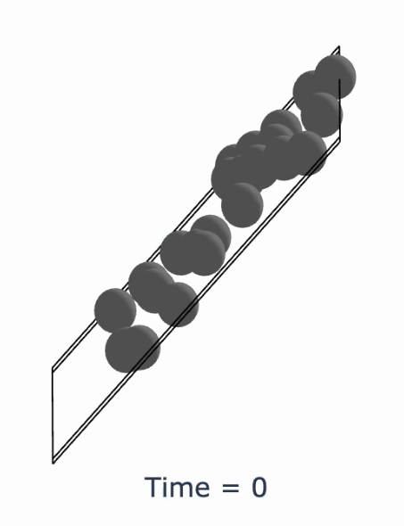

<div align="center">

<h1> Chemeleon </h1>
  <p>
    <strong>A text-guided diffusion model for crystal structure generation
    </strong>
  </p>
  <div style="display: flex; justify-content: center; align-items: center;">
    
    
  </div>
</div>

<p align="center">
 <a href="https://8501-01j80snre5xdhq828s1q5brs0m.cloudspaces.litng.ai/">
     
 </a>
  <a href="https://pypi.org/project/chemeleon">
     
 </a>
 <a href="https://chemrxiv.org/engage/chemrxiv/article-details/6728e27cf9980725cf118177">
     
 </a>
 <a href="https://github.com/hspark1212/chemeleon/blob/main/LICENSE">
     
 </a>
</p>

# Overview

Chemeleon is a text-guided diffusion model designed for crystal structure generation. The tool allows users to explore and generate crystal structures either through natural language descriptions or by specifying target compositions and navigating chemical systems.

## Key Features

- `Text-Guided Generation`: Generate crystal structures from descriptive text inputs, enabling intuitive exploration of material properties.
- `Composition-Based Generation`: Create structures with specific chemical compositions, aiding targeted material discovery.
- `Chemical System Navigation`: Systematically explore complex chemical systems by specifying elements of interest.

## Demo Application

A demo version of Chemeleon is available at [Chemeleon App](https://8501-01j80snre5xdhq828s1q5brs0m.cloudspaces.litng.ai).
>[!NOTE]
> The demo is currently in beta and hosted on Lightning Studio. The server will automatically shut down when not in use and may take approximately 2 minutes to restart.

For local deployment, you can run the application on your machine with the following command:

```bash
streamlit run app/steamlit_app.py
```

## Table of Contents

- [Installation](#installation)
- [Getting Started](#getting-started)
- [Training](#training)
- [Evaluation](#evaluation)
- [Citation](#citation)
- [License](#license)

# Installation

## Prerequisites

- Python 3.10 or later

```bash
conda create -n chemeleon python=3.10
conda activate chemeleon
```

- Pytorch >= 1.12 (install from the [official website](https://pytorch.org/) suitable for your environment)
  
>[!NOTE]
> It is recommended to install PyTorch prior to installing `chemeelon` to avoid potential issues with GPU support.
> The training of chemeleon models was implemented using PyTorch 2.1.0.

`chemeleon` can be installed from PyPI or the source code.

## Install from PyPI

```bash
pip install chemeleon
```

## Install from Source Code

```bash
git clone https://github.com/hspark1212/chemeleon.git
cd chemeleon
pip install -e .
```

To verify the installation, run the code in the [demo.ipynb](./demo.ipynb) notebook.

# Getting Started

`Chemeleon` provides both a Python API and a command-line interface (CLI) for generating crystal structures based on text prompts, target specific compositions and navigating chemical systems.

## 0. Python API

Let's start with a simple example using the Python API. You can run this code in the [demo.ipynb](https://github.com/hspark1212/chemeleon/blob/main/demo.ipynb) notebook:

```python
import chemeleon
from chemeleon.visualize import Visualizer

# Load default model checkpoint (general text types)
chemeleon = chemeleon.load_general_text_model()

# Set parameters
n_samples = 5
n_atoms = 6
text_inputs = "A crystal structure of LiMnO4 with orthorhombic symmetry"

# Generate crystal structure
atoms_list = chemeleon.sample(text_inputs, n_atoms, n_samples)

# Visualize the generated crystal structure
visualizer = Visualizer(atoms_list)
visualizer.view(index=1)
```

## 1. Generate Crystal Structures Using Text Prompts using CLI

Generate crystal structures from textual descriptions, enabling intuitive material design.

>[!NOTE]
>The current version of Chemeleon v0.1.1 was trained with textual description consisting of composition (e.g. LiMnO4) and crystal system (e.g. orthorhombic, hexagonal, cubic). The model was trained with general type of text inputs created by LLMs (OpenAI API).

```bash
chemeleon sample prompt --text-input "A crystal structure of LiMnO4 with orthorhombic symmetry" --n-atoms 6 --n-samples 3 --save-dir results/prompt
```

In this example, `Chemeleon` generates 3 (`--n-samples`) crystal structures based on the text prompt provided (`--text-input`). Each structure will contain 6 (`--n-atoms`) atoms in the unit cell. The results are saved in the results/prompt (`--save-dir`) directory.

<details>
<summary> Options </summary>

- `--text-input` or `-t`: Textual description of the crystal structure to generate.
- `--n-atoms`: Number of atoms in the generated crystal structure.
- `--n-samples`: Number of crystal structures to generate.
- `--save-dir` or `-s`: Directory to save the generated crystal structures.

</details>

>[!TIP]
>
>- Ensure your text prompt includes both the composition and the crystal symmetry for better results.
>- `--n-atoms` parameter should be consistent with the stoichiometry of the composition provided.

## 2. Generate Crystal Structures Using Target Compositions using CLI

Generate crystal structures based on specific chemical compositions, aiding in targeted material discovery.

>[!NOTE]
>For the target composition, Chemeleon uses a composition-based model trained with textual descriptions of compositions in a strict format (e.g., Ti1 O2).

```bash
chemeleon sample composition --target-composition "TiO2" --n-samples 100 --max-natoms 40 --max-factor 13 --save-dir results/TiO2
```

In this example, `Chemeleon` generates structures for multiple stoichiometries of the target composition TiO2 (`--target-composition`), up to a maximum Z (multiplication) factor of 13 (`--max-factor`).
This means it will generate structures for Ti1O2, Ti2O4, ..., Ti13O26, ensuring the total number of atoms does not exceed 40 atoms (`--max-natoms`).
For each stoichiometry, 100 structures (`--n-samples`) are generated. Duplicate structures are removed using Pymatgen's `StructureMatcher`, and unique structures are saved in the results/TiO2 (`--save-dir`) directory.

<details>
<summary> Options </summary>
Options:

- `--target-composition` or `-t`: The target chemical composition (e.g., TiO2).
- `--n-samples`: Number of structures to generate (default: 100).
- `--max-natoms`: Maximum number of atoms allowed in a structure (default: 40).
- `--max-factor`: Maximum Z (multiplication) factor for the composition's stoichiometry (default: 13).
- `--save-dir` or `-s`: Directory to save the generated structures (default: results/TiO2).

</details>

>[!TIP]
>
>- Chemeleon will generate structures for stoichiometries from the base composition up to the specified --max-factor.
>- If you want to generate structures for a single stoichiometry, set --max-natoms to the maximum number of atoms in the stoichiometry and --max-factor to 1.
>- After generation, duplicate structures are filtered out to retain only unique structures.

## 3. Navigate Chemical Systems using CLI

Systematically explore complex chemical systems by specifying elements of interest, narrowing down the search space using chemical filters provided by [SMACT](https://github.com/WMD-group/SMACT).

>[!NOTE]
>For navigating chemical systems, Chemeleon uses a composition-based model trained with textual descriptions of compositions in a strict format (e.g., Ti1 O2).

```bash
chemeleon navigate system --elements Zn,Ti,O --n-samples 100 --max-stoich 8 --max-natoms 40 --max-factor 8 --save-dir results/navigate
```

In this example, `Chemeleon` explores chemical systems containing zinc (Zn), titanium (Ti), and oxygen (O) elements (`--elements`). It enumerates all possible compositions with up to 8 stoichiometric coefficient (`--max-stoich`), following the chemical filters provided by SMACT. Then, it generates 100 structures (`--n-samples`) for each composition, ensuring that the total number of atoms in each structure does not exceed 40 atoms (`--max-natoms`) and the Z factor is less than 8 (`--max-factor`). After generation, duplicate structures are filtered out to retain only unique structures using Pymatgen's StructureMatcher. The unique structures are saved in the results/navigate directory (`--save-dir`).

<details>
<summary> Options </summary>

- `--elements` or `-e`: Elements to include in the chemical system (e.g., Zn, Ti, O).
- `--max-stoich`: Maximum stoichiometric coefficient for the composition (default: 8).
- `--n-samples`: Number of samples to generate for each composition (default: 100).
- `--max-natoms`: Maximum number of atoms allowed in a structure (default: 40).
- `--max-factor`: Maximum Z (multiplication) factor for the composition's stoichiometry (default: 8).
- `--save-dir` or `-s`: Directory to save the generated structures (default: results/navigate).

</details>

>[!TIP]
>
>- The specified elements are used to generate all possible compositions within the stoichiometric range up to --max-stoich.
>- `smact_validity` function from SMACT is used to filter out invalid compositions.
>- After generation, duplicate structures are filtered out to retain only unique structures.

# Training

## 0. Dataset

The training dataset, `mp-40`, consists of crystal structures obtained from the Materials Project, each with fewer than 40 atoms per unit cell. Textual descriptions of these materials are generated using the OpenAI API.

A detailed guide for preprocessing this dataset can be found in the Jupyter notebook located at:

[`data/mp-40/data_preparation.ipynb`](https://github.com/hspark1212/chemeleon/blob/main/data/mp-40/data_preparation.ipynb).

The processed dataset is split into training, validation, and test sets, saved in:

[`data/mp-40/train.csv`](https://github.com/hspark1212/chemeleon/blob/main/data/mp-40/train.csv)
[`data/mp-40/val.csv`](https://github.com/hspark1212/chemeleon/blob/main/data/mp-40/val.csv)
[`data/mp-40/test.csv`](https://github.com/hspark1212/chemeleon/blob/main/data/mp-40/test.csv)

## 1. Training Text Encoder

The first step involves training the `Crystal CLIP`, which is a Transformer-encoder based (BERT) model trained with contrastive learning to align text embeddings with 3D structural embeddings derived from graph neural networks (GNNs).

```bash
python run_crystal_clip.py with clip_prompt
```

This command runs the training of Crystal CLIP with general text inputs (e.g. "A crystal structure of LiMnO4 with orthorhombic symmetry").

Alternatively, the text encoder can be trained with different types of text inputs:

- Composition-based inputs: `clip_composition` (e.g., Li1 Mn1 O4)
- Formatted text inputs: `clip_composition_crystal_system` (e.g., "composition: LiMnO4, crystal system: orthorhombic")

>[!NOTE]
>The detailed configuration can be found at [`config.py`](https://github.com/hspark1212/chemeleon/blob/main/chemeleon/config.py).

## 2. Denoising Diffusion Model

After training the text encoder, the next step is to train the denoising diffusion model. This model generates crystal structures conditioned on text embeddings derived from `Crystal CLIP`. Conditional sampling is implemented using a classifier-free guidance scheme.

```bash
python run.py with chemeleon_clip_prompt
```

Like the text encoder, the diffusion model can be trained with different text input types:

- General text: `chemeleon_clip_prompt`
- Composition-based text: `chemeleon_clip_composition`
- Formatted text: `chemeleon_clip_composition_crystal_system`

>[!NOTE]
>The detailed configuration can be found at [`config.py`](https://github.com/hspark1212/chemeleon/blob/main/chemeleon/config.py).

# Evaluation

Once training is complete, the model can be evaluated by sampling crystal structures based on textual descriptions in the test set `data/mp-40/test.csv`. The model generates 20 structures for each textual description.

To run the evaluation script, use:

```bash
python chemeleon/scripts/evaluate.py with model_path=`path/to/model`
```

This script will output the following metrics:

- `valid_samples`: Number of valid samples generated.
- `unique_samples`: Number of unique samples generated.
- `structure_matching`: Percentage of structures that match the ground truth.
- `meta_stable`: Percentage of structures that have lower energy than the ground truth.
- `composition_matching`: Percentage of structures that have the same composition as the ground truth.
- `crystal_system_matching`: Percentage of structures that have the same crystal system as the ground truth.
- `lattice_system_matching`: Percentage of structures that have the same lattice system as the ground truth.

>[!TIP]
> The result of the evaluation for Chemeleon v0.1.1 can be found at [WandB](https://wandb.ai/hspark1212/Chemeleon_v0.1.1?workspace=user-hspark1212).

# Citation

If you find our work helpful, please refer to the following publication:
["Exploration of crystal chemical space using text-guided generative artificial intelligence" Chemxiv (2024)](https://chemrxiv.org/engage/chemrxiv/article-details/6728e27cf9980725cf118177)

```
@article{chemeleon,
  title={Exploration of crystal chemical space using text-guided generative artificial intelligence},
  author={Park, Hyunsoo and Onwuli, Anthony and Walsh, Aron},
  journal={ChemRxiv},
  doi={10.26434/chemrxiv-2024-rw8p5},
  year={2024}
}
```

# License

This project is licensed under the MIT License, developed by [Hyunsoo Park](https://hspark1212.github.io) as part of the [Materials Design Group](https://github.com/wmd-group) at Imperial College London.
See the [LICENSE file](https://github.com/hspark1212/chemeleon/blob/main/LICENSE) for more details.
